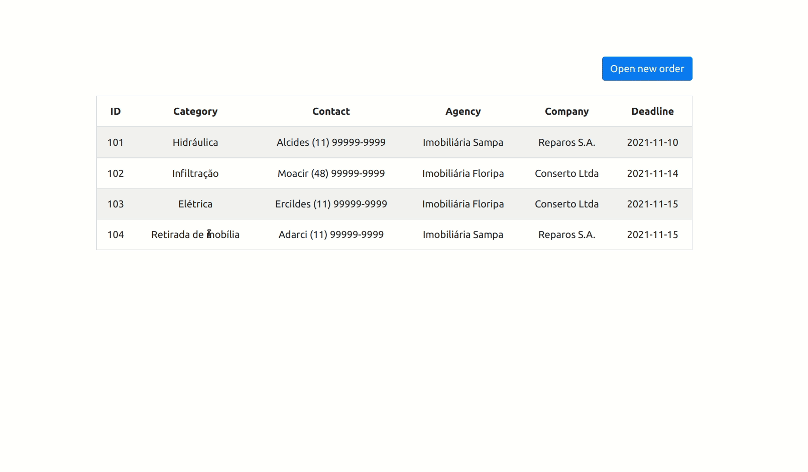

# Refera - Fullstack Code Challenge

## Description

This project was built for Refera's Fullstack Code Challenge. It allows the user to create, list, and view home repair orders.



## Running the server: development mode

### Prerequisites

- Python 3
- nodejs

### Running the services

(Optional) Create a new Python environment

```
python3 -m venv fullstack-challenge-env
source fullstack-challenge-env/bin/activate
```

To run the backend service:

- Enter the backend directory
- Install the Python dependencies
- Create and migrate the DB tables
- Generate some mock data
- Run the Django development server
```
cd backend/
pip install -r requirements.txt
./manage.py migrate
./manage.py shell < create_mock_data.py
./manage.py runserver
```
In a different terminal session, run the frontend service with:

```
cd frontend/
npm install
npm start
```

## To be done
### Running the server: Production environment

The Django&React combination is very flexible and can be production-deployed in many different services, the most popular of them is [Heroku](https://www.heroku.com/). The main steps to get the project production-ready are removing debug flags and secrets and adding an uWSGI configuration.

### Authentication

Django provides an [user authentication mechanism](https://docs.djangoproject.com/en/3.2/topics/auth/) easy to implement, which carries most of the core functionalities needed for authentication out of the box.

### Further Database structure

#### Real estate agency registration data

Models changes:

- New table to store real estate agency data
- Update Order model to include a FK to RealEstateAgency

```
+ RealEstateAgency:
+ name: string
+ phone: string
+ address: string
+ national_registry: string

Order:
- agency: string
+ agency: FK to RealEstateAgency
```

Other updates: Update Order serializer and endpoint to traverse RealEstateAgency.
#### Company registration data

Models changes:

- New table to store companies data
- Update Order model to include a FK to Company

```
+ Company:
+ name: string
+ phone: string
+ address: string
+ national_registry: string

Order:
- company: string
+ company: FK to Company
```

Other updates: Update Order serializer and endpoint to traverse Company.

#### Contact registration data

Models changes:

- New table to store contacts data
- Update Order model to include a FK to Contact

```
Contact:
first_name: string
last_name: string
email: string
username: string
password: string
phone: string
address: string
identity_number: string

Order:
- contact_name: string
- contact_phone: string
+ contact: FK to Contact
```

Other updates: Update Order serializer and endpoint to traverse Contact.
